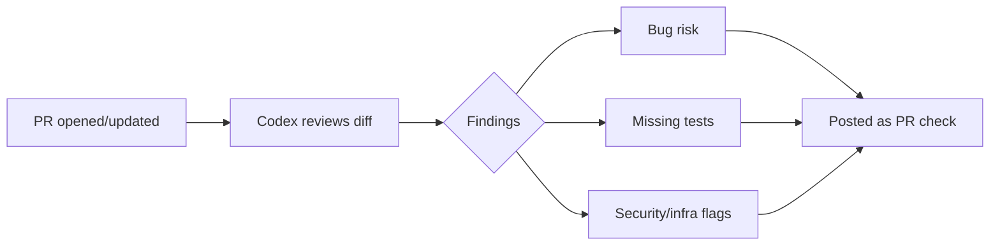

# 🚧 Gatekeeper — Codex-Powered PR Review Agent

  

> 💡 **Every PR gets a second reviewer that never gets tired — installs in any repo in minutes.**



---

A GitHub Action that runs OpenAI Codex against every pull-request diff and posts a structured review — bugs, missing tests, infra/security flags — built while working through *The Complete OpenAI Codex Masterclass 2026*, shipped as reusable developer tooling rather than course exercises.

## 🧩 Sub-projects
- **`scaffold-from-spec/`** — Codex-driven scaffolding of a real internal tool from a written spec, with the prompt log kept alongside the generated code
- **`pr-review-action/`** — the core: a Codex-powered diff reviewer that posts structured findings as a GitHub check
- **`test-gen-report/`** — Codex-generated test suite for an existing repo, with a before/after coverage delta report

## 🚀 Master Project
A GitHub Action, installable in any repo via a workflow file + config, that sends every PR's diff to Codex and posts a structured review comment (bug risk, missing tests, security/infra flags) as a required or advisory check.

## ⚡ Quickstart
```bash
git clone <your-fork-url> && cd gatekeeper
cp .env.example .env        # OPENAI_API_KEY
./scripts/setup.sh
./scripts/dev.sh            # run the reviewer against a local diff
```

## 🗺️ Roadmap
- [ ] `scaffold-from-spec` case study with kept prompt log
- [ ] `pr-review-action` core reviewer logic + findings schema
- [ ] GitHub Action packaging (`action.yml`) so any repo can adopt it
- [ ] `test-gen-report` coverage-delta case study
- [ ] Documented on a repo that isn't this one, as proof it works cross-repo

## 📈 At 10x Scale, I'd
Cache diff review results by commit SHA to avoid re-reviewing unchanged code on rebase, add a config file so teams can tune severity thresholds, and rate-limit/batch calls to stay under API quota on large monorepos.

## 🔍 Originality vs. the Course
The course teaches Codex fundamentals and first-project scaffolding; this repo turns that into installable CI tooling with its own findings schema and a coverage-delta case study the course doesn't cover.

## 📄 License
MIT – see `LICENSE`.
